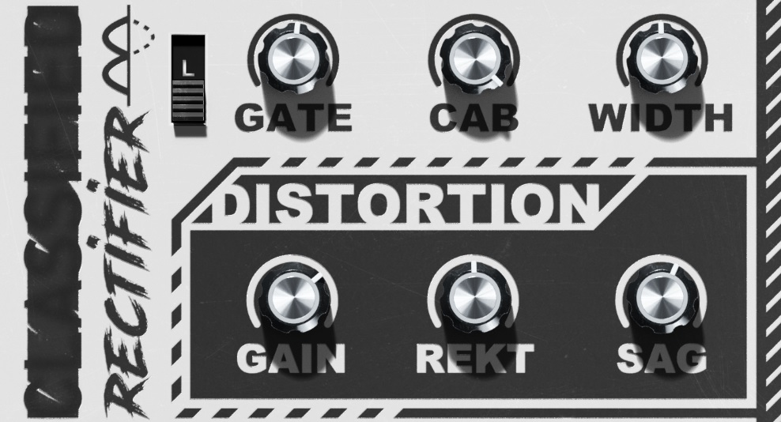

# rektifier
A Amp combo plugin for heavily distored guitar sounds.

[Short (loud) demo with changing parameters](./loud_demo.mp3)

It's based on a [GuitarD](https://github.com/TobiasKozel/GuitarD) preset with a UI only exposing a few control parameters.
